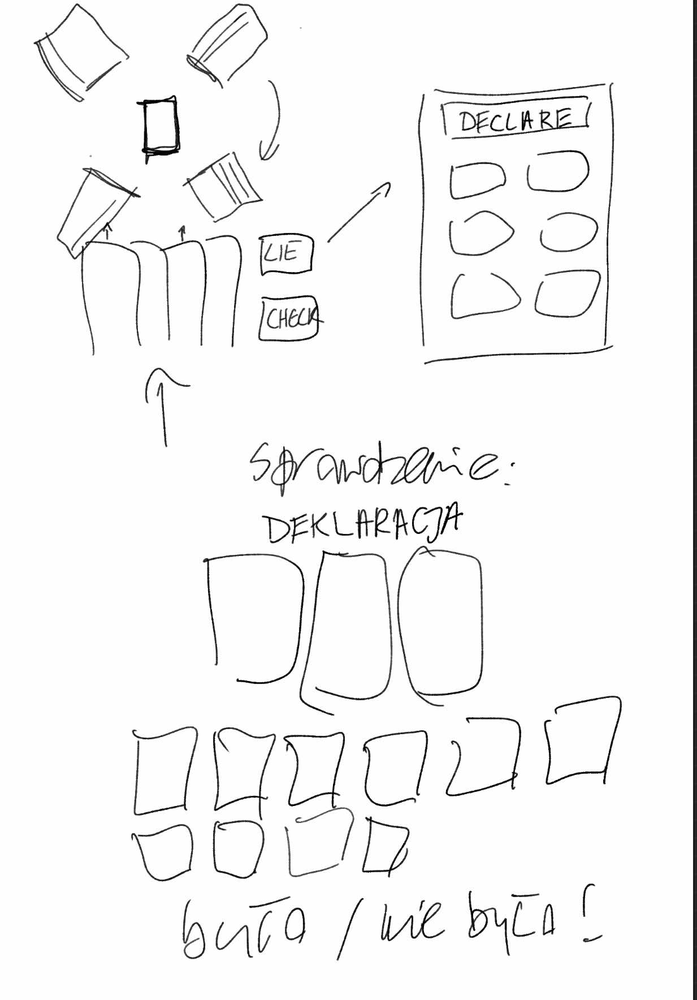

# Functionalities

* Single and multi-player gameplay.
* Ability to play against AI opponents.
* Arcade mode with special abilities.
* Visually appealing design, engaging graphics and animations
to enhance the gaming experience.
* In-game chat to enable player communication during gameplay.

# Technologies

To create a robust and engaging card game website that works seamlessly
on both desktop and mobile devices, we will pick out and utilize **SOME**
of the following technologies:

## Frontend:

* React: A popular JavaScript library for building user interfaces,
enabling a responsive and dynamic user experience.
* Redux: For state management, ensuring that the game state is
consistent and easily manageable across components.
* CSS Frameworks: Such as Tailwind CSS or Bootstrap, to create a
modern and responsive design quickly.
* Canvas API: For rendering game graphics and animations, providing a
smooth gaming experience.

## Backend:

* Node.js: To build the server-side application, allowing for real-time
communication and efficient handling of multiple requests.
* Express: A minimal and flexible Node.js web application framework for
building RESTful APIs to manage user accounts and game data.
* Socket.IO: For real-time, bidirectional communication between clients
and the server, enabling multiplayer gameplay.

## Deployment:

* it will be a node app inshallah
* Docker: For containerizing the application, making it easy to
deploy across different environments.
* Heroku or Vercel: For hosting the web application with easy
scaling options.
* GitHub Actions: For CI/CD to automate testing and deployment
processes.

## Mobile Responsiveness:

Responsive Web Design: Using media queries and flexible layouts to
ensure the game is playable on various devices, including smartphones
and tablets.

# FrontEnd design

Here are some mind maps of various views that will be accessible to
the end user when playing:

